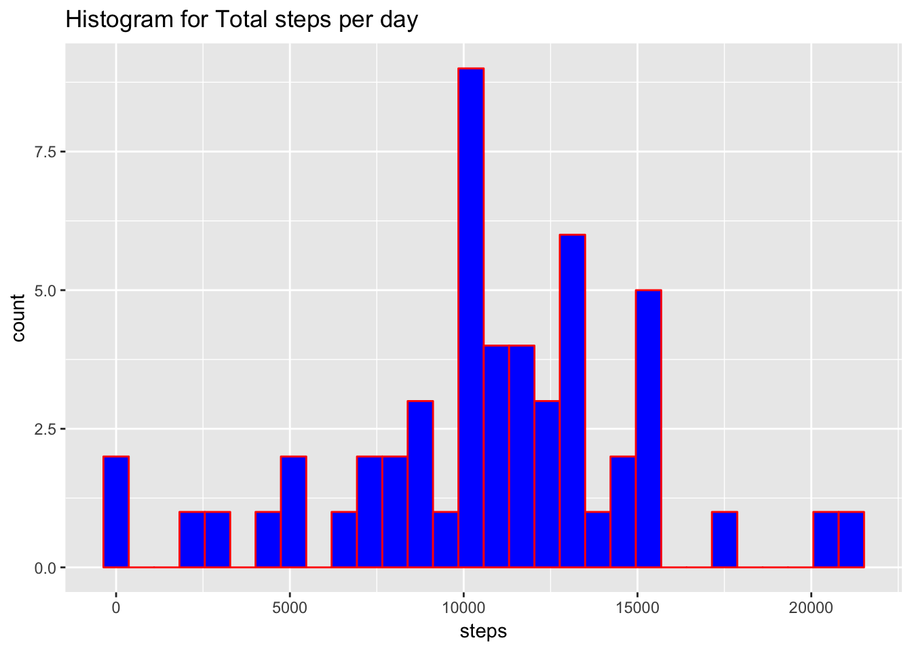
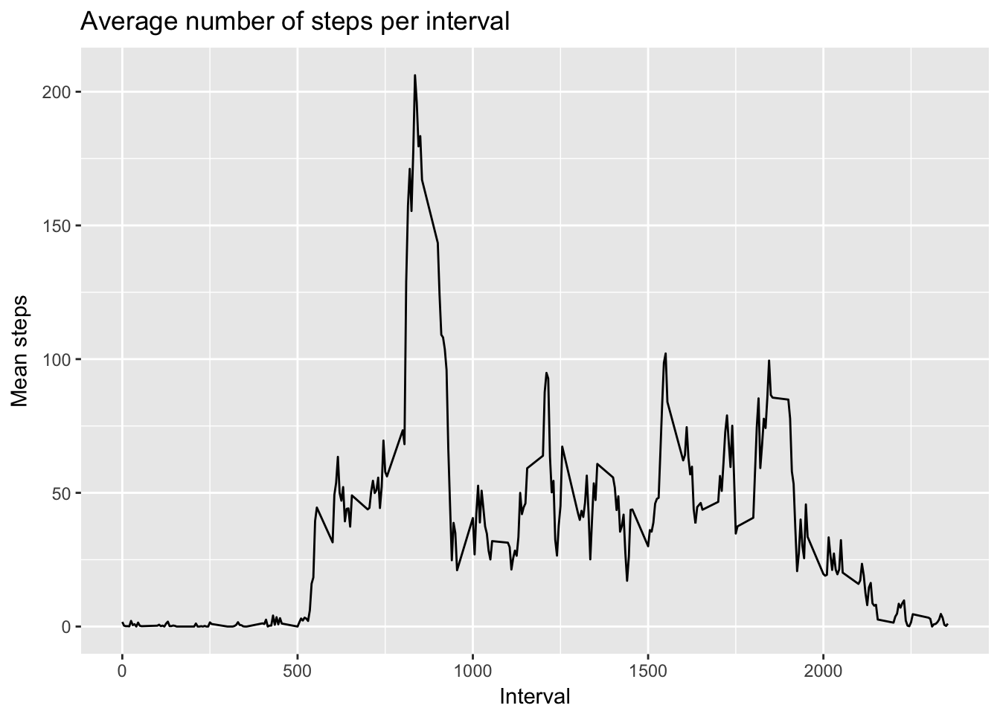
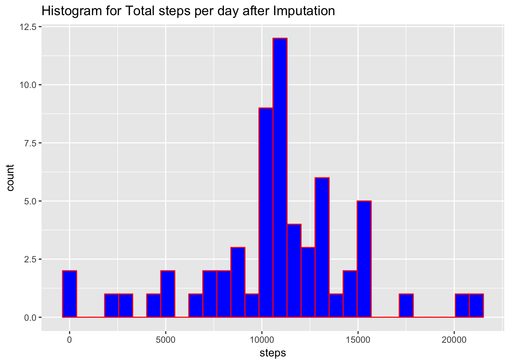
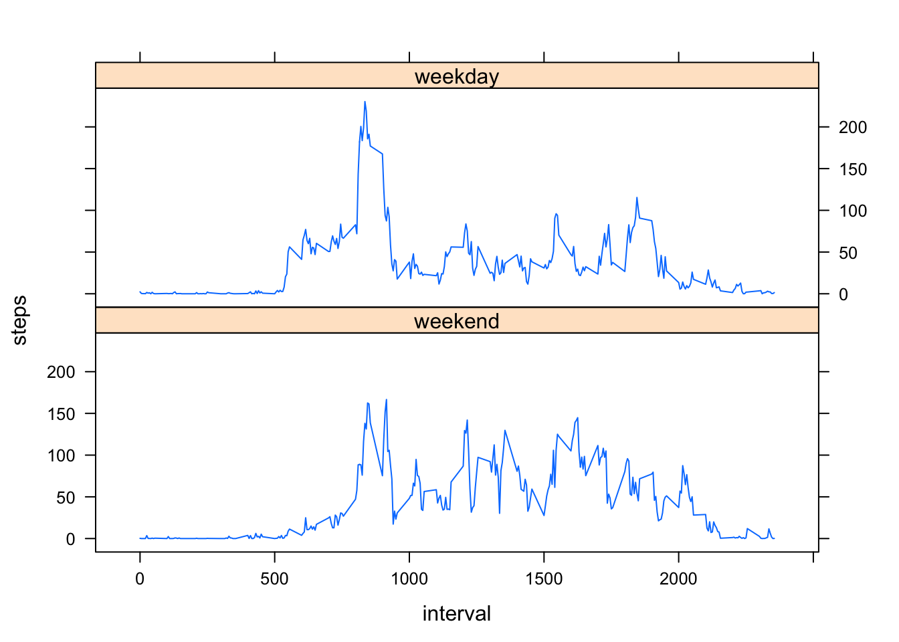

# Reproducible Research: Peer Assessment 1


## Loading and preprocessing the data

```r
activity <- fread("activity.csv")
```

## What is mean total number of steps taken per day?

### Calculate the total number of steps taken per day

```r
stepPerDay <- aggregate(steps ~ date, data=activity, sum)
```
### Make a histogram of the total number of steps taken each day

```r
qplot(stepPerDay$steps,
      geom="histogram",
      bins=30,  
      main = "Histogram for Total steps per day", 
      xlab = "steps",  
      fill=I("blue"), 
      col=I("red"))
```

<!-- -->

### Calculate and report the mean and median of the total number of steps taken per day

```r
stepPerDayMean <- as.integer(round(mean(stepPerDay$steps, na.rm=TRUE)))
stepPerDayMedian <- median(stepPerDay$steps, na.rm=TRUE)
```
The mean of the total number of steps take per day is 10766.  
The median of the toal number of steps take per day is 10765.

## What is the average daily activity pattern?  

### Make a time series plot of the 5-minute interval (x-axis) and the average number of steps taken, averaged across all days (y-axis)  

```r
stepPerInt <- aggregate(steps ~ interval, data=activity, mean)
names(stepPerInt) <- c("interval","mean_steps")

ggplot(stepPerInt, aes(x=interval, y=mean_steps)) + 
  geom_line()  + 
  xlab("Interval") + ylab("Mean steps") + 
  ggtitle("Average number of steps per interval")
```

<!-- -->

```r
dev.off()
```

```
## null device 
##           1
```
### Which 5-minute interval, on average across all the days in the dataset, contains the maximum number of steps?

```r
max_int <- stepPerInt[which.max(stepPerInt$mean_steps),]$interval
max_int_step <- stepPerInt[which.max(stepPerInt$mean_steps),]$mean_steps
```
The 5-minute interval 835 contains the max steps of 206.1698113, on average across all the days contains the maximum number of steps . 

## Imputing missing values

### Calculate and report the total number of missing values in the dataset

```r
nmiss <- sum(is.na(activity$steps)) 
```
There are total of 2304 missing values in the dataset.  

### Filling in all of the missing values in the dataset with mean value of steps on that interval. 
 
I will use the mean for the 5-minute interval to populate NA values for a given internval.

### Create a new dataset that is equal to the original dataset but with the missing data filled in.

```r
newactivity <- merge(activity, stepPerInt, by = 'interval', all.y = F)

newactivity$steps[is.na(newactivity$steps)] <- as.integer(round(newactivity$mean_steps[is.na(newactivity$steps)]))

keep <- names(activity)
newactivity <- subset(newactivity[order(date,interval),],select=keep)
```

### Make a histogram of the total number of steps taken each day. 

```r
stepPerDayNew <- aggregate(steps ~ date, data=newactivity, sum)

qplot(stepPerDayNew$steps,
      geom="histogram",
      bins=30,  
      main = "Histogram for Total steps per day after Imputation", 
      xlab = "steps",  
      fill=I("blue"), 
      col=I("red"))
```

<!-- -->

```r
dev.off()
```

```
## null device 
##           1
```
### Calculate and report the mean and median total number of steps taken per day. 

```r
stepPerDayMeanNew <- as.integer(round(mean(stepPerDayNew$steps, na.rm=TRUE)))
stepPerDayMedianNew <- median(stepPerDayNew$steps, na.rm=TRUE)
```

### Do these values differ from the estimates from the first part of the assignment? What is the impact of imputing missing data on the estimates of the total daily number of steps? 

The mean of steps taken per day before and after imputation is 10766 and 10766 respectively. The median of steps taken per day before and after imputation is 10765 and 10762 respectively. 

The mean and median were lower after imputation which I replaced NAs with mean value of any given interval. 

## Are there differences in activity patterns between weekdays and weekends?

### Create a new factor variable in the dataset with two levels "weekday" and "weekend" indicating whether a given date is a weekday or weekend day.

```r
newactivity$weekDay <- weekdays(as.Date(newactivity$date))
weekdays <- c('Monday', 'Tuesday', 'Wednesday', 'Thursday', 'Friday')
newactivity$daytype <- factor((newactivity$weekDay %in% weekdays), levels=c(FALSE, TRUE), labels=c('weekend','weekday'))
```
### Make a panel plot containing a time series plot of the 5-minute interval (x-axis) and the average number of steps taken, averaged across all weekday days or weekend days (y-axis). 


```r
stepPerIntPerDaytype <- aggregate(steps ~ interval+daytype, data=newactivity, mean)

xyplot(steps~interval | daytype, data=stepPerIntPerDaytype, type="l", layout=c(1,2))
```

<!-- -->

Overall weekends show more regular activity throughout the day than on weekdays.

